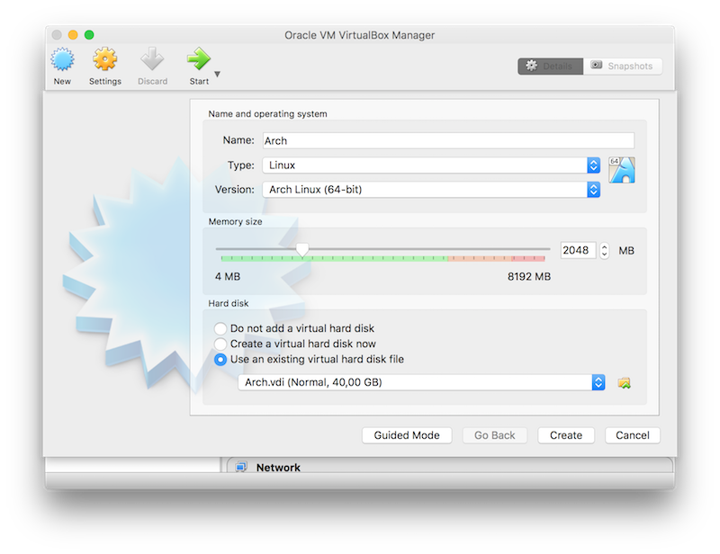
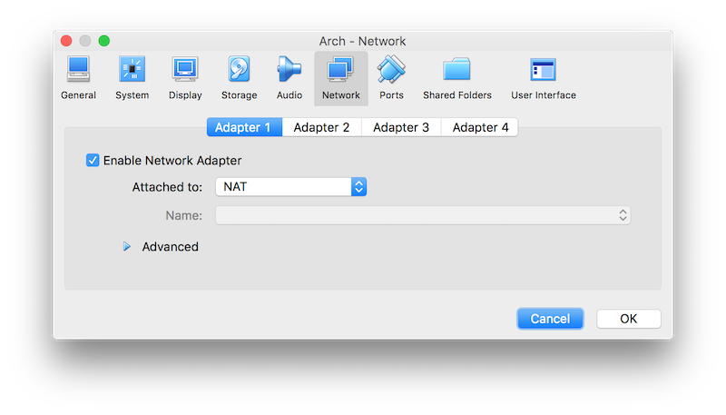
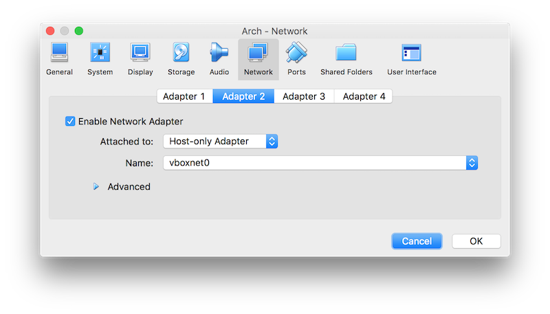
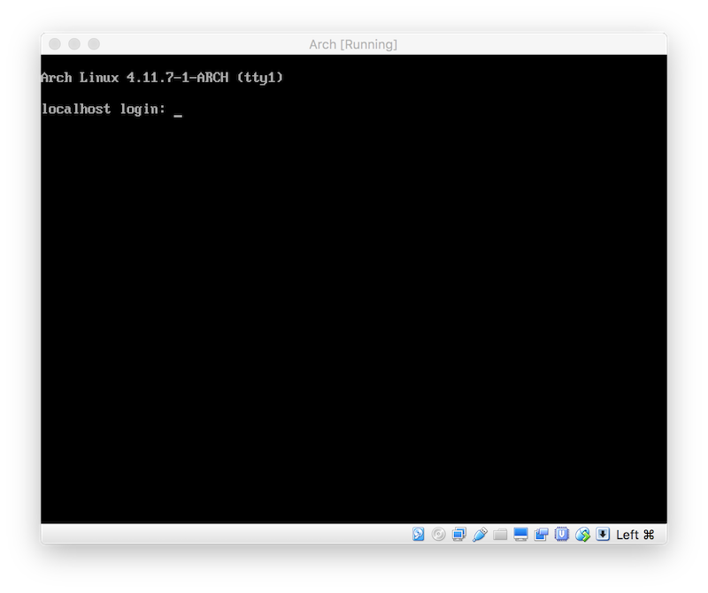
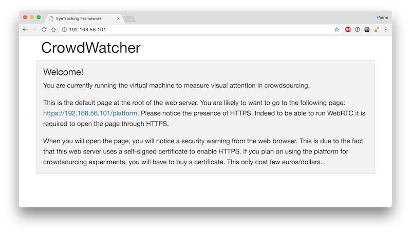

# CrowdWatcher

This project is the open-source eye tracking platform `CrowdWatcher`. It enables researchers to measure visual attention and user engagement in a crowdsourcing context through traditional RGB webcams. 

Its general idea is to use conventional RGB cameras, such as the one provided with a laptop, to measure where the participants are looking on the screen faced to them. The key aspect of the platform is to use the interactions of the user with his computer as a way to perform an online calibration of the eye tracker. Indeed, it is expected that when a participant performs an action such as a click, he will be looking at the position on the screen while performing the click. Therefore, at the very moment of the click, it is possible to relate pupil center position from the video stream to a position on the screen. Based on this principle, a browser-based real- time audio/video processing using WebRTC was developed enabling to perform tests in a crowdsourcing context.

The platform has two parts: a client and a server side. The client side employs WebRTC to turn on the camera of the participants and record their face while performing the task, and in parallel record actions of the user with the platform. 

The server side of the platform is in charge of delivering the content to the client, retrieving the measurements performed on the client side, and performing the fixations estimations based on the webcam video stream and user actions logs.

# Structure of the project

   - The folder `analysis` provides the tools necessary to estimate fixations based on the webcam video stream and user action logs.

   - The folder `www` contains the web applications which have to be installed on the server to distribute the crowdsourcing experiment. 

# Virtual machine

A easy to use virtual machine can be found on Zenodo: 

Using this virtual machine, you can easily run the platform. 

   - First, download the virtual machine and uncompress it to obtain the Arch.vdi file

   - Then, you can use VirtualBox to create a new virtual machine which use an existing virtual hard disk file. Then, create the virutal machine. 

- In the preference of VirtualBox (NOT in the preference of your virtual machine!!!), you will have to go to network and make a new Host only network (if you don't already have one). Click on the button "+" of the right side you don't have an interface like "vboxnet0".

- In the preference of the Arch virtual machine, check that in the network tab, the adapter 1 is attached to NAT (this allows the virtual machine to have Internet access).

- In the preference of the Arch virtual machine, check that in the network tab, the adapter 2 is attached to "Host-only adapter", and select the name such as it match to an existing "Host only network". (This allows you to connect to the virtual machine from your host computer via the IP: 192.168.56.101). 

- You may start the virtual machine. Once the operating system is loaded, it requests a user. The default user is "archie" and the password is "arch". It is however, not necessary to log in.  

- You may open Google Chrome, and connect to the virtual machine at the address: http://192.168.56.101/ where you will find the default page. The eye tracking platform can be found at https://192.168.56.101/platform

# Build the analysis tool

The provided virtual machine does not contains a build of the analysis tools. It was chosen to do so, as the analysis tool requires OpenCV which would have needed to include a X server which would have doubled the size of the virtual machine. Moreover, the virtual machine was meant as a web server and therefore does not need graphical interface. 

However, to easily use the fixation predictions and saliency map generation, a compiled version of the tools is provided for Windows. These can be found in the release section of github. 

If you are using a computer running Linux or Mac OS X, the tools can be easily built from the source. 

The dependencies are `boost` and `OpenCV`. These can be installed using `apt-get`, `pacman`, ... on Linux or `homebrew` on Mac OS X. 

Once the dependencies are installed, the first step is to compile the CLM-framework. This can be achieved by going into the folder `analysis/clmframework`, run `cmake CMakeLists.txt` and `make`.

Then, to compile the `Fit` tool, it is only necessary to go to the folder `analysis/Fit` and run `make`.

All tools are now compiled and can be used to analyze the videos.

# Run a test

   - Setup the platform or the virtual machine

   - Connect to https://192.168.56.101/platform and follow the steps. (With the virtual machine, you will have a security warning due to the use of a self-signed certificate. You need to buy a valid certificate for running crowdsourcing experiments. It only cost few euros/dollars)

   - Once the test is completed you may find the videos with the participants's face and XML logs about their actions in "www/eyetracker/public/uploads/".

   - Let `user1_video.webm` and `user1_click.xml` be the two files contained in the uploads folder. 

   - Run the tool `clmframework/bin/FeatureExtraction -ofeatures_2d .\face_features.csv -f .\user1_video.webm` to obtain the facial features. 

   - Run the fit tool `Fit/fit -f face_features.csv -c user1_click.xml -o user1_fixations.csv` to obtain the fixations predictions and confidence intervals.

   - Finally, run the MATLAB script `MATLAB/getSalMap('user1_fixations.csv')` to obtain the saliency map. 

# Publications related to this work

   - Pierre Lebreton, Alexander Raake, Evangelos Skodras, Toni Mäki, Isabelle Hupont and Matthias Hirth (2014), "Bridging the gap between eye tracking and crowdsourcing", ITU-T SG12 Contribution 233, Source: Deutsche Telekom AG Q13/12, Q14/12, Sept. 02 2014

   - Pierre Lebreton, Evangelos Skodras, Toni Mäki, Isabelle Hupont and Matthias Hirth, (2015), "Bridging the gap between eye tracking and crowdsourcing", SPIE Conference on Human Vision and Electronic Imaging XX, San Francisco

   - Pierre Lebreton, Isabelle Hupont, Toni Mäki, Evangelos Skodras and Matthias Hirth, (2015), "Eye tracker in the wild, studying the delta between what is said and done in a crowdsourcing experiment", Proceedings of the 2015 Inter- national ACM Workshop on Crowdsourcing for Multimedia, Brisbane, Australia

The CLM Framework used in order to perform features extractions in videos:

   - Tadas Baltrusaitis, Peter Robinson, and Louis-Philippe Morency. Constrained Local Neural Fields for robust facial landmark detection in the wild. in IEEE Int. Conference on Computer Vision Workshops, 300 Faces in-the-Wild Challenge, 2013

   - Erroll Wood, Tadas Baltrusaitis, Xucong Zhang, Yusuke Sugano, Peter Robinson, and Andreas Bulling, Rendering of eyes for eye-shape registration and gaze estimation, in IEEE International Conference on Computer Vision, 2015

   - https://github.com/TadasBaltrusaitis/CLM-framework

