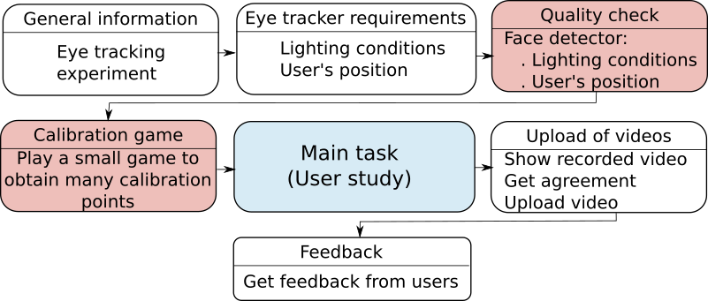

This folder contains the web application to handle the capture/upload of user's action.

The Rails application `eyetracker` correspond to the eyetracker framework which will be the entry point of any test using the platform. This application take care of providing general information to the participants on how to prepare themselves to do the test. It will also take care of running the calibration steps, open a new website for the main study, close it, and will upload the videos to the server. 

The Rails application `Preference` is an example of study which will be run inside the eyetracker platform. This is a sub-website which will be contained inside the `eyetracker` application. (The main application is `eyetracker`).
 
The following figure illustrates the interaction between the two web applications.

The application `eyetracker` takes care of all the different steps EXCEPT the main task. The main task being carried on by the application `demo_study`. 

The appliccation `Preference` is an exemplary experiment which runs a pairwise experiment to compare images. 

